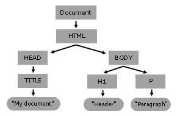

## Manipulating DOM objects

### What is the DOM?
                        
- DOM stands for **Document Object Model**

- The DOM is a programming interface for HTML and XML

- The DOM represents the structure of a document in memory

- The DOM is an object-oriented representation of the web page
    
- The DOM lets other programming languages manipulate the document

[https://developer.mozilla.org/en-US/docs/Web/API/Document_Object_Model](https://developer.mozilla.org/en-US/docs/Web/API/Document_Object_Model){:target="_blank"}
                        
### The DOM's content tree 

```html
<html>
<head>
  <title>My Document</title>
</head>
<body>
  <h1>Header</h1>
  <p>Paragraph</p>
</body>
</html>
```

When a browser such as Chrome or Firefox parses an HTML document, it builds a **content tree** and then uses it to **display** the document.



[https://developer.mozilla.org/en-US/docs/Web/API/Document_object_model/Using_the_W3C_DOM_Level_1_Core](https://developer.mozilla.org/en-US/docs/Web/API/Document_object_model/Using_the_W3C_DOM_Level_1_Core){:target="_blank"}
                       
### Accessing the Document

In JavaScript, the `Document` interface represents any web page loaded in the browser and serves as an entry point into the web page's content, which is the DOM tree.

Access the `document` object and its properties from the Chrome DevTools.

```js
document;
document.location; // Read-only, Location object (info about current URL).
document.location = "https://heig-vd.ch/"; // Setter to update displayed URL.
document.designMode = "on"; // Lets user interactively modify page content.
document.referrer; // URI of page that linked to this page.
```

[https://developer.mozilla.org/en-US/docs/Web/API/Document](https://developer.mozilla.org/en-US/docs/Web/API/Document){:target="_blank"}
                        
### Accessing the Elements of the DOM

The `Element` interface represents the HTML elements loaded in the DOM tree.

```js
console.log(document.getElementById("id"));
console.log(document.getElementsByClassName("slide"));
console.log(document.getElementsByTagName("h1"));
```

CSS Selectors can also be used to query elements.

```js
console.log(document.querySelector("ul > li")); // selects the first matching element
console.log(document.querySelectorAll("ul > li")); // selects all matching elements
```

Elements can then be modified in JavaScript.

```js
document.getElementsByClassName("slide")
    .forEach(el => el.style = "background-color: blue");

let element = document.getElementById("my-icon");
element.innerHTML = "<p>Hello, World!</p>";
element.setAttribute("href", "https://www.heig-vd.ch/");
element.className;
element.classList;
element.children;
```

[https://developer.mozilla.org/en-US/docs/Web/API/Element](https://developer.mozilla.org/en-US/docs/Web/API/Element){:target="_blank"}
                      
### Listening to DOM Events

DOM Events are sent to notify code of interesting things that have taken place. Each event is represented by an object which is based on the Event interface, and may have additional custom fields and/or functions used to get additional information about what happened.

```js
document.onkeydown = function(event) {console.log(event);}
document.addEventListener('keydown', event => console.log(event))
```

Important DOM events include `load`, `click`, `mouseenter`, etc.

```js
element.addEventListener('mouseenter', event => doSomething());
```

The propagation of an event in the DOM can be stopped programatically.

```js
event.stopPropagation();
```

Event handlers can also be registered from the HTML.

```html
<a href="http://www.heig-vd.ch" onclick="event.stopPropagation();">
```

[https://developer.mozilla.org/en-US/docs/Web/Events](https://developer.mozilla.org/en-US/docs/Web/Events){:target="_blank"}

<!-- ### DOM Manipulation Libraries

Libraries such as [jQuery](https://jquery.com/) and [Zepto](https://jquery.com/) are intended at simplifying DOM manipulation by extending the DOM and providing helpers.

```html
<script src="https://ajax.googleapis.com/ajax/libs/jquery/3.4.1/jquery.min.js"></script>
```

```js
$(document).ready(function(){
    $("p").click(function(){
        $(this).hide();
    });
});
```

JQuery uses an **imperative style** that requires to specify the changes in the order they should happen. Modern frameworks use a **declarative style** (such as React, Angular or Vue).
                        
### Depending or not depending?

The Peter Parker principle:


### Must Read
- [Thou shalt not depend on me (NDSS 2017)](https://blog.acolyer.org/2017/03/07/thou-shalt-not-depend-on-me-analysing-the-use-of-outdated-JavaScript-libraries-on-the-web/)
- [Small world with high risks (USENIX Security 2019)](https://blog.acolyer.org/2019/09/30/small-world-with-high-risks/)

Notes:

As an appetizer for these reads: the situation is bad.

Each package indirectly depends on tens and tens of other packages on average, making more than a third of packages dependent on vulnerable code. This is due to old packages, poor dependency management, and poor awareness. -->
