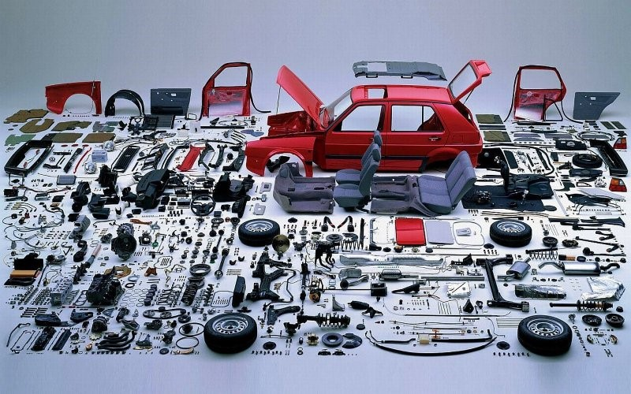
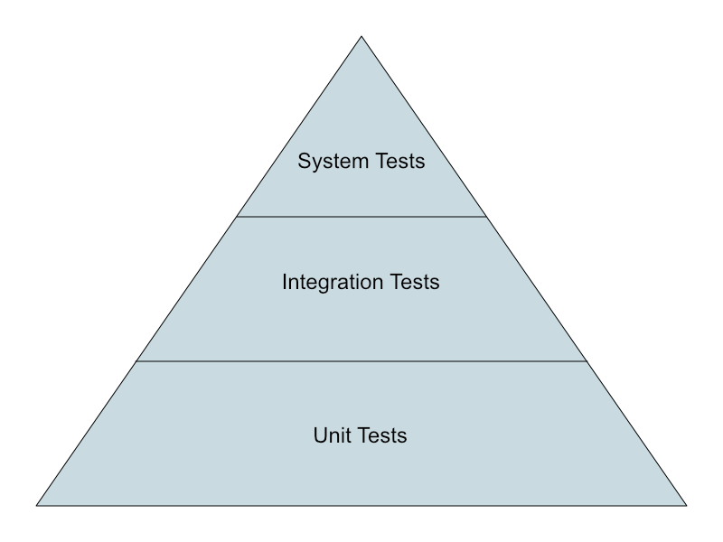

# Testing JavaScript Applications

https://xkcd.com/844/

### How to write good code?

*If you haven't tested it, assume it is broken!*

But from where should I start?

Recall the cornerstones of computational thinking:
- Decomposition
- Data Representation / Pattern recognition
- Generalization / Abstraction
- Algorithm

*The whole is greater than the sum of its parts.* 
**Aristotle**

### Test automation

In software testing, test automation is the use of a software separate from the software being tested to control the execution of tests and the comparison of actual outcomes with predicted outcomes.

https://en.wikipedia.org/wiki/Test_automation

### Grab the code

https://github.com/web-classroom/test-automation
                       
### Types of tests

### Unit tests

- Test a **separable unit of software** for correctness, independently of the larger software System
- Employed as a **low-level** specification to ensure that a function or module performs as expected
- Usually fast to implement and execute
- **Example:** *testing that the subscriber's email is valid*

### Integration Tests

- Individual units of software that pass unit tests are **assembled together into components**
- Integration tests ensure that the components made of different parts work well together
- Sometimes slow to implement and execute
- **Example:** *test that the email was persisted in the subscriber table of the database*

### System Tests

- All the component that pass the integration tests are **assembled together into the system**
- System tests verify the **end-to-end functionality** of the system
- Usually **hard to automate** and very expensive to implement and execute
- **Example:** test that the user can subscribe to the mailing list b accessing the server from the chrome browser
                       
### Key takeaways

- If you haven't tested it, assume it is broken!
- Decomposition is the best friend of testable code
- When testing, write:
   - A lot of unit tests
   - Some integration tests
   - Few selected system tests
                       

https://landing.google.com/sre/books/ 

**Chapter 17:** Testing for Reliability
