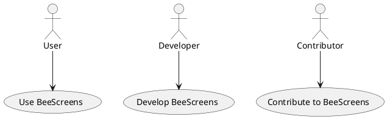

Empty home for introducing your concepts.

```plantuml
@startuml
skinparam monochrome true
skinparam shadowing false
skinparam componentStyle uml2

actor User
actor Developer
actor Contributor

User --> (Use BeeScreens)
Developer --> (Develop BeeScreens)
Contributor --> (Contribute to BeeScreens)

@enduml
```
