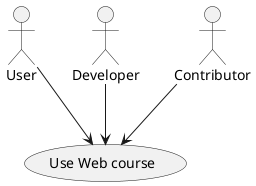

Empty home for introducing your concepts.

See the presentation of the [course](./tutorials/pitch.md) for more information.

# Tests

```typescript
import { Bee } from '@ethersphere/bee-js'
```
## First part of the title


