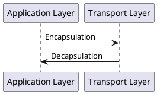
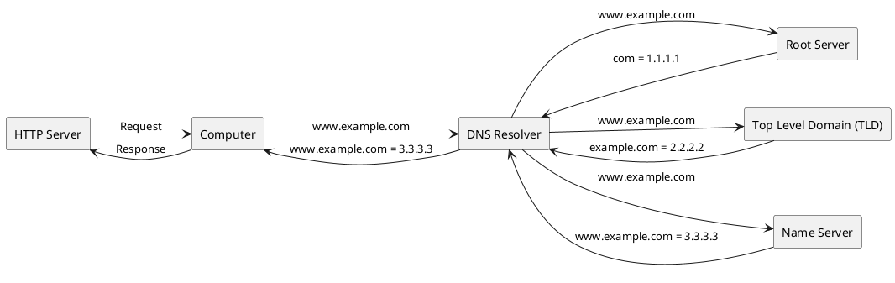

## Web Technologies
# Week 1 - INTRODUCTION
Bertil Chapuis

---

## Overview of Today's Class

- Internet
- World Wide Web (WWW)
- Uniform Resource Locator (URL)
- HyperText Transfer Protocol (HTTP)
- Hypertext Markup Language (HTML) 
- Cascading Style Sheets (CSS)

---

# Internet

---

## Internet's Conceptual Model

The **Internet Protocol Suite** is the conceptual model and set of communications protocols used in the Internet and similar computer networks.
- The **Application Layer** specifies the shared communications protocols and interface methods used by hosts in a communications network.<br>**Examples:** HTTP, HTTPS, FTP, SSH, SMTP, IMAP, Telnet, etc.
- The **Transport Layer** provide host-to-host communication services, such as connection-oriented communication, reliability, and flow control.<br>**Examples:** TCP, UDP, etc.
- The **Internet Layer** transports packets from the originating host across network boundaries to the destination host specified by an IP address.<br>**Examples:** IP, ICMP (traceroute), IPsec (VPN), etc.
- The **Link Layer** is the group of methods and communications protocols that operate on the link that a host is physically connected to.<br>**Examples:** ARP, PPP, MAC (Ethernet, Wifi, DSL, Fiber), etc.

https://en.wikipedia.org/wiki/Internet_protocol_suite

---

## Internet's Conceptual Model

<table>
		<tr>
				<th>OSI</th>
				<th>Internet Protocol Suite</th>
				<th>Protocols</th>
				<th>Data Unit</th>
		</tr>
		<tr>
				<td>Application</td>
				<td rowspan="3" class="centered">Application Layer</td>
				<td rowspan="3" class="centered">HTTP/HTTPS</td>
				<td rowspan="3" class="centered">Request/Response</td>
		</tr>
		<tr>
				<td>Presentation</td>
		</tr>
		<tr>
				<td>Session</td>
		</tr>
		<tr>
				<td rowspan="2" class="centered">Transport</td>
				<td rowspan="2" class="centered">Transport Layer</td>
				<td>SSL/TLS</td>
				<td rowspan="2" class="centered">Segment</td>
		</tr>
		<tr>
				<td>TCP/UDP</td>
		<tr>
				<td>Network</td>
				<td>Internet Layer</td>
				<td>IP</td>
				<td>Packet/Datagram</td>
		</tr>
		<tr>
				<td>Data Link</td>
				<td rowspan="2" class="centered">Link Layer</td>
				<td>Ethernet/WiFi</td>
				<td>Frame</td>
		</tr>
		<tr>
				<td>Physical</td>
				<td>Wire/Fiber</td>
				<td>Signal</td>
		</tr>
</table>


---

## Domain Name System

The <b>Domain Name System (DNS)</b> is a hierarchical and decentralized naming system (phone book) for computers connected to the Internet. 
It translates domain names to IP addresses needed for locating and identifying computers.



The DNS protocol uses <b>TCP</b> for Zone transfer and <b>UDP</b> for name queries.

---

## <i class="fab fa-js"></i> Higher-Order Functions

Higher-order functions allow us to abstract over actions, not just values. 
For example, we can have functions that create new functions.

```javascript
function greaterThan(n) {
	return m => m > n;
}
let greaterThan10 = greaterThan(10);
console.log(greaterThan10(11)); // true
```

https://eloquentjavascript.net/05_higher_order.html

---

## Mozilla's Definition

The World Wide Web - commonly referred to as WWW, W3, or the Web - is an interconnected system of public webpages accessible through the Internet. The Web is not the same as the Internet: the Web is one of many applications built on top of the Internet.

The system we know today as "the Web" consists of several components:
- The HTTP protocol governs data transfer between a server and a client.
- To access a Web component, a client supplies a unique universal identifier, called a URL (uniform resource location) or URI (uniform resource identifier).
- HTML (hypertext markup language) is the most common format for publishing web documents.

https://developer.mozilla.org/en-US/docs/Glossary/World_Wide_Web
